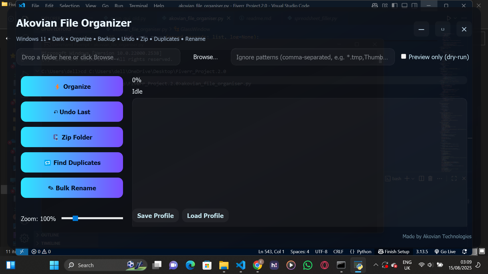
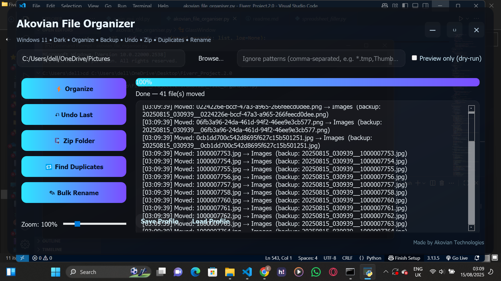
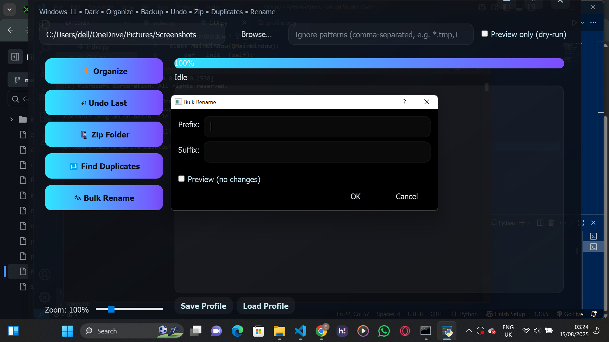
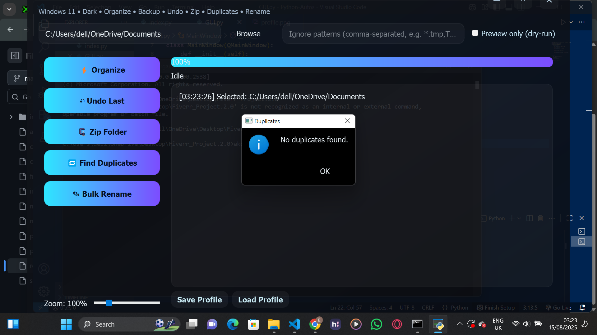

# File Organizer – Python + PyQt5 Desktop App

**File Organizer** is a Python + PyQt5 desktop application that automatically sorts files into folders by type, date, or custom rules.  
Includes batch renaming, duplicate detection, and scheduled runs to keep your workspace clutter-free.

---

## 🚀 Features
- **Auto-Sort Files** – Organize files by type, date, or custom rules.
- **Batch Rename** – Rename multiple files at once using patterns.
- **Duplicate Finder** – Detect and remove duplicate files.
- **Scheduled Runs** – Automate organization at regular intervals.
- **Simple GUI** – No coding knowledge required.

---

## 🖼️ Screenshots

  
*Main app interface showing folder selection and sorting options.*

  
*Settings panel where you can customize sorting rules and schedule runs.*

  
*Batch rename feature for quickly renaming multiple files.*

  
*Duplicate file detection in action.*

---

## 🛠️ Installation
```bash
pip install PyQt5
📦 Usage
bash
Copy
Edit
python file_organizer.py
Select a folder to organize.

Choose sorting options (type, date, custom rules).

Click Organize.

Optionally enable scheduled runs for hands-free organization.

💡 Use Cases
Organizing Downloads folder

Photo and video libraries

Work project directories

Shared office computers

📜 License
This project is licensed under the MIT License.

yaml
Copy
Edit

---

